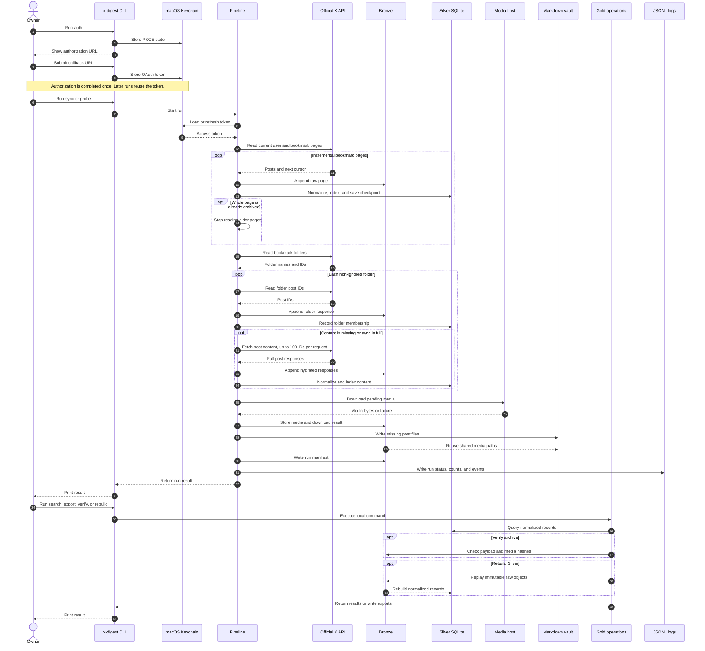

# X Digest

X Digest keeps a private, local copy of your X bookmarks. It reads data from
the official X API, stores the raw responses and media, and builds a searchable
SQLite catalog.

This first version does not create posts, generate summaries, or use an LLM.

## How It Works



The pipeline is synchronous and runs only when the owner invokes the CLI. Bronze
is the append-only source layer; Silver and the Markdown files are derived local
outputs. The application performs read-only X operations and keeps the archive
inside the local `data/` vault.

## Requirements

- macOS
- Python 3.11 or newer
- [`uv`](https://docs.astral.sh/uv/)
- An X Developer application with OAuth 2.0 PKCE enabled

## Install

```bash
git clone https://github.com/joaomj/x-digest.git
cd x-digest
uv sync
```

Register this redirect URI in the X Developer application:

```text
http://localhost:8080/callback
```

Set the client ID in `.env`:

```text
XDIGEST_X_CLIENT_ID=your-client-id
```

Use the OAuth 2.0 settings shown in the X Developer Console. Set the app
permission to read and enable bookmark, post, and user read scopes. Keep the
client secret in the local `.env` file. Do not commit it or send it in chat.

Set `XDIGEST_X_CLIENT_SECRET` only when the X application requires a client
secret. The `.env` file stays local and is ignored by Git.

## Authorize X

Run:

```bash
uv run x-digest auth
```

Open the printed URL and authorize the application. Copy the complete callback
URL from the browser address bar and run:

```bash
uv run x-digest auth --callback-url 'http://localhost:8080/callback?code=...&state=...'
```

The OAuth token is stored in the macOS Keychain. X Digest does not write an X
post or modify bookmark state.

## Sync Bookmarks

Run the normal bookmark sync. It reads new bookmarks (X returns bookmarks
newest-first), then folders, then media:

```bash
uv run x-digest sync
```

The sync is incremental. X Digest stops reading bookmark pages as soon as a
whole page contains posts that are already archived, so an unchanged archive
costs exactly one API call per run. Folder post contents are re-fetched only
for posts that are not archived with complete content yet, and folders are
re-read at most once per `XDIGEST_FOLDER_SYNC_DAYS` days (default 7) because
folders rarely change. Run `sync --full` to force a complete re-read including
folders.

The official X API bookmarks endpoint (`GET /2/users/{id}/bookmarks`) offers no
`since_id` or equivalent incremental filter; its only cursor is the opaque
`pagination_token`. Stopping at an already-archived page is therefore the only
supported incremental strategy (docs.x.com/x-api/bookmarks/get-bookmarks).

Run a complete re-read to detect edits to old posts and re-hydrate all folder
content:

```bash
uv run x-digest sync --full
```

For bounded CLI testing only, limit the read to one bookmark page:

```bash
uv run x-digest sync --max-pages 1
```

For a bounded API test without writing Bronze or Silver content:

```bash
uv run x-digest sync --max-pages 1 --dry-run
```

The sync stores raw API pages, folder responses, normalized posts, bookmark
membership observations, and media download results.
Folder responses contain post IDs only, so X Digest retrieves their contents in
batches of up to 100 IDs before indexing them.

Skip one or more bookmark folders by name or ID. Their posts are never fetched,
archived, or indexed:

```bash
uv run x-digest sync --ignore-folder spam --ignore-folder 'folder id'
```

Set the same list in `.env` with a comma-separated value:

```text
XDIGEST_IGNORE_FOLDERS=spam
```

## Logs And Measured Cost Data

Every command writes structured JSONL logs. The aggregate log rotates by size,
and every sync or probe run also has its own immutable log file:

```text
<project-root>/data/logs/
├── application.jsonl            # rotated aggregate (5 MB x 5 backups)
├── application.jsonl.1 ...      # rotated backups
└── runs/<run_id>.jsonl          # one immutable file per run
```

Every log line carries a `correlation_id`. For sync and probe runs, the
correlation ID equals the run ID, so one ID links the log files, the `runs`
table, `run_events`, Bronze objects, and observations.

Control the log level with `--log-level` or the environment variable:

```bash
uv run x-digest --log-level debug sync
```

```text
XDIGEST_LOG_LEVEL=info
```

The end of every sync run records measured X API usage: request count per
endpoint, retried attempts, and the lowest `x-rate-limit-remaining` and
`x-app-limit-remaining` values observed. This data appears in the `api_usage`
log event and in the run summary shown by `status`. A warning is logged when a
rate limit falls below 20% of its capacity. The log size settings are
`XDIGEST_LOG_MAX_BYTES` (default 5000000) and `XDIGEST_LOG_BACKUPS` (default 5).

## X API Costs

Pricing record. Retrieved from official X documentation on 2026-08-16.

Official facts (X API changelog, docs.x.com):

- X launched Pay-Per-Use pricing on 2026-02-06. Billing and plan details now
  live in the Developer Console at console.x.com.
- Since 2026-04-20, reads of your own data are "Owned Reads" at USD 0.001 per
  resource. `GET /2/users/{id}/bookmarks` is listed as an Owned Read endpoint.
- Post creation costs USD 0.015 per post, or USD 0.20 when the post contains a
  URL.
- The official documentation does not publish a full public rate card. The
  console shows current per-endpoint rates.

Reported rates (unofficial, consistent across independent third-party sources,
2026-07): post read USD 0.005, user read USD 0.010, owned read USD 0.001,
monthly cap of 2,000,000 post reads. Verify current rates in the console.

Measured usage. The runs on 2026-08-02 used 14 requests each, with no retries:

| Endpoint | Requests |
| :--- | ---: |
| `/2/users/me` | 1 |
| `/2/users/{id}/bookmarks` | 1 |
| `/2/users/{id}/bookmarks/folders` | 1 |
| `/2/users/{id}/bookmarks/folders/{folder_id}` | 10 |
| `/2/tweets` | 1 |

Media downloads do not use X API quota; they fetch files from X media hosts.

Weekly estimate. One sync per week, folder content re-read weekly:

- About 14 requests per run, about 60 per month, about 730 per year.
- At the reported rates, the expected cost is about USD 0.03 per week, USD
  0.12 per month, and USD 1.40 per year.
- The weekly volume is far below any published monthly cap.

## Inspect Bookmark Samples

After authorization, fetch one bounded bookmark page and exactly one ordinary
post plus one Article from that page:

```bash
uv run x-digest probe-bookmarks --max-results 20
```

The command never paginates through the full bookmark collection. Increase
`--max-results` only when the first bounded page does not contain an Article.

## Inspect One Post

Use `probe-post` to fetch exactly one post. This command is useful for checking
the API response shape for one ordinary post or one X Article:

```bash
uv run x-digest probe-post 'https://x.com/user/status/1234567890'
```

It does not enumerate bookmarks.

## Search And Export

```bash
uv run x-digest status
uv run x-digest search "local archive"
uv run x-digest show 1234567890
uv run x-digest export-post 1234567890 --output ./post.md
uv run x-digest export --format markdown
uv run x-digest export --format json --output ./bookmarks.json
```

Verify the archive:

```bash
uv run x-digest verify --full
```

Rebuild the normalized database from the immutable raw layer. The ignore list
(`--ignore-folder` or `XDIGEST_IGNORE_FOLDERS`) is applied, so ignored folders
stay out of the rebuilt records:

```bash
uv run x-digest rebuild-silver
```

## Markdown Output

Every sync and probe run writes a Markdown file for each newly archived post,
following your bookmark organization:

```text
data/markdown/
├── posts/                  # posts bookmarked directly, in no folder
│   └── 1234567890.md
└── folders/                # posts organized by bookmark folder
    └── agents/
        └── 9876543210.md
```

A post that belongs to several folders gets one file in each folder directory.
Unsafe characters in folder names are replaced with `_`; two folders with the
same name get their ID appended to the directory name.

Each file contains the post text (or full Article body), its author, date, and
source URL. When a post has downloaded media, the file references it: images
appear inline with `` and videos and other media appear as
clickable links. The paths point at the media files inside `data/bronze/`, so
there is only one copy of each media file.

Markdown files follow the same policy as the database records: a file is
written once when the post is first archived and is never regenerated, so
hand-made edits are safe. Posts that have neither text nor media produce no
file.

Generate Markdown for all posts that still lack a file, without any sync and
without consuming X API quota:

```bash
uv run x-digest markdown
```

The command is local and idempotent: it only creates missing files.

## Local Storage

The vault lives in `data/` inside the project root:

```text
<project-root>/data/
├── bronze/              # immutable API responses + media
├── silver.sqlite        # normalized records + FTS5 index
├── markdown/posts/      # one Markdown file per archived post
├── logs/                # rotated aggregate + per-run log files
```

The project is fully self-contained. Move the entire directory to
relocate everything.

Change the vault location with:

```text
XDIGEST_VAULT_PATH=/path/to/vault
```

Bronze objects are never overwritten or deleted by X Digest.

## Automated Weekly Sync

X Digest runs as a launchd LaunchAgent on macOS. It runs `x-digest sync` every
Sunday at 06:00 local time. The agent runs in your user session, so it can read
the X token from the Keychain. Launchd starts the agent again after a reboot.

Install or update the agent:

```bash
./scripts/install-scheduler.sh
```

Remove the agent:

```bash
./scripts/install-scheduler.sh --remove
```

The agent writes its command output to `data/logs/scheduler.out.log` and
`data/logs/scheduler.err.log`. Every sync also writes its normal run records
and `api_usage` events. The first run can be triggered immediately:

```bash
launchctl kickstart "gui/$(id -u)/com.x-digest.sync"
```

Inspect the agent state:

```bash
launchctl print "gui/$(id -u)/com.x-digest.sync"
```

## Scope Boundaries

The current version does not include:

- X write operations.
- Summaries or LLM processing.
- X data-export archive import.
- A web interface.
- Multiple X accounts.
- Alternative transports such as browser-cookie clients.
